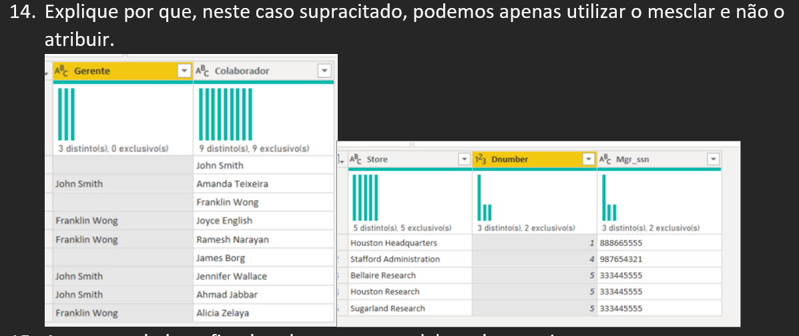

# Desafio: Processamento e Transformação de Dados com Power BI

Este repositório contém a resolução do desafio de projeto da **DIO (Digital Innovation One)**, focado na limpeza, transformação e manipulação de dados utilizando o **Power BI (Power Query)**.

O objetivo principal foi preparar uma base de dados (cenário de empresa/RH) para modelagem, garantindo a qualidade e integridade das informações.

## 📊 Dashboard de Validação

Para verificar a consistência dos dados transformados, foram criados visuais simples e cartões de KPI:

---

## 📝 Diretrizes do Desafio (Passo a Passo)

Abaixo estão listadas as etapas de transformação realizadas no Power Query:

### 1. Verificação e Limpeza Inicial
* **Cabeçalhos e Tipos de Dados:** Revisão completa para garantir que todas as colunas tivessem os tipos corretos (texto, número, data).
* **Valores Monetários:** Conversão das colunas de salário e orçamento para o tipo `Double Precise` (Número Decimal) para cálculos precisos.
* **Tratamento de Nulos:** Análise de valores nulos (`null`). Identificou-se que colaboradores com `Super_ssn` nulo são os **Gerentes**.
* **Verificação de Departamentos:** Validou-se se existiam departamentos sem gerentes associados.

### 2. Transformação e Modelagem
* **Separação de Colunas:** Colunas complexas foram divididas para facilitar a leitura.
* **Mesclagem (Merge) de Tabelas:**
    * Tabela `Employee` com `Departament`: Adição do nome do departamento à tabela de empregados.
    * Tabela `Employee` (Auto-junção): Cruzamento da tabela com ela mesma para trazer o **Nome do Gerente** ao lado do nome do colaborador.
* **Combinação de Nomes:** As colunas de `Primeiro Nome` e `Sobrenome` foram mescladas para formar uma única coluna de **Nome Completo**.
* **Limpeza Final:** Remoção de colunas desnecessárias que não seriam utilizadas no relatório final.

---

## 💡 Pergunta Teórica (Item 14)

**Desafio:** *Mescle os nomes de departamentos e localização. Explique por que, neste caso, podemos apenas utilizar o mesclar e não o atribuir.*

### Resposta / Explicação

A operação correta é o **Mesclar (Merge)** e não o Atribuir (Append) pela natureza da estrutura dos dados que queremos criar:

1.  **Mesclar (Merge):**
    * Funciona como uma junção lateral (**Horizontal**).
    * Utilizamos quando queremos combinar colunas de duas tabelas diferentes (ou colunas diferentes) baseadas em um identificador comum ou relação lógica.
    * *Neste caso:* Queremos criar uma combinação única de `Departamento` + `Localização` na mesma linha (ex: "TI - São Paulo"). Isso cria um identificador único para auxiliar no modelo estrela (Star Schema).

2.  **Atribuir (Append):**
    * Funciona como uma união vertical (**Empilhamento**).
    * Utilizamos quando queremos adicionar mais linhas a uma tabela existente (ex: juntar vendas de Janeiro com vendas de Fevereiro).
    * *Por que não usar:* Se usássemos o atribuir, teríamos uma lista com nomes de departamentos e, logo abaixo, uma lista de localizações, sem vínculo lógico entre eles na mesma linha.

---

## 🛠️ Ferramentas Utilizadas
* **Microsoft Power BI Desktop**
* **Power Query Editor** (Linguagem M)

## 👤 Autor
Projeto desenvolvido durante o bootcamp de Análise de Dados da DIO.
